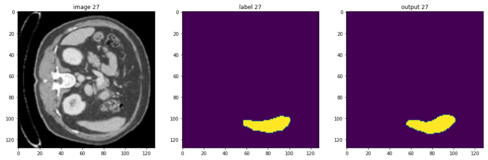
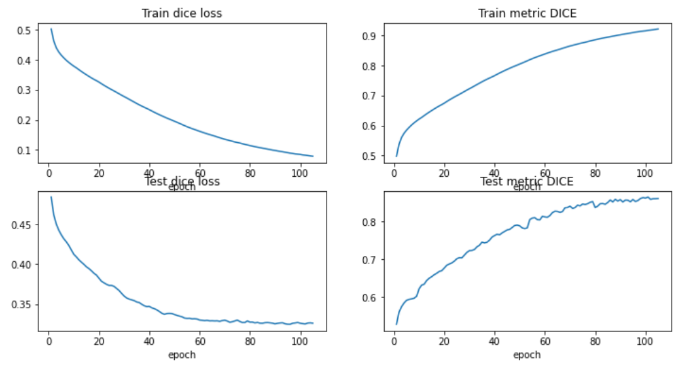

# 🧠 Liver Segmentation using MONAI and PyTorch

This project implements a **3D medical image segmentation pipeline** using **MONAI and PyTorch** for liver segmentation from CT scan data. The same pipeline can be extended to segment other organs as well.

---

## 🖼️ Sample Output

<p align="center">
  
</p>

---

## 📌 Overview

The goal of this project is to perform **accurate liver segmentation** from volumetric medical images using deep learning techniques.

It includes:

* Data preprocessing using MONAI
* Training a 3D U-Net model
* Visualization of CT scan slices and segmentation masks
* Evaluation using standard segmentation metrics

---

## ⚙️ Setup

Clone the repository:

```bash
git clone https://github.com/shivam-shaurya/liver-tumor-segmentation-ml
cd liver-tumor-segmentation-ml
```

Install dependencies:

```bash
pip install monai
pip install -r requirements.txt
```

---

## 🧪 Data Visualization

To better understand the dataset and preprocessing pipeline, the following utility function is used to visualize CT scan slices along with segmentation masks:

```python
def show_patient(data, SLICE_NUMBER=1, train=True, test=False):
    """
    Visualize CT scan slices and segmentation masks
    """
```

This helps in verifying preprocessing steps and inspecting model inputs.

---

## 🧠 Model Architecture

The model is based on **3D U-Net**, implemented using MONAI:

```python
model = UNet(
    dimensions=3,
    in_channels=1,
    out_channels=2,
    channels=(16, 32, 64, 128, 256), 
    strides=(2, 2, 2, 2),
    num_res_units=2,
    norm=Norm.BATCH,
).to(device)
```

* Encoder–Decoder structure
* Skip connections for better localization
* Designed for volumetric segmentation tasks

---

## ▶️ Training

Training is performed using the script:

```bash
python train.py
```

The pipeline includes:

* Preprocessing using MONAI transforms
* Batch training on 3D CT volumes
* Optimization using Dice-based loss

---

## 📊 Results & Performance

<p align="center">
  
</p>

The model demonstrates:

* Stable training convergence
* Effective segmentation of liver regions
* Accurate boundary detection in CT slices

---

## 🧪 Testing

Model evaluation and visualization of predictions are performed using:

* `testing.ipynb`
* Includes:

  * Loss curves
  * Dice score trends
  * Output predictions on test data

---

## 📁 Project Structure

```
├── train.py
├── preprocess.py
├── testing.ipynb
├── images/
├── dataset/
```

---

## ⚠️ Note

This project is implemented for learning and experimentation using publicly available medical imaging frameworks and resources.

---

## 📬 Contact

Shivam Shaurya
📧 [shivamshaurya774@gmail.com](mailto:shivamshaurya774@gmail.com)

---
